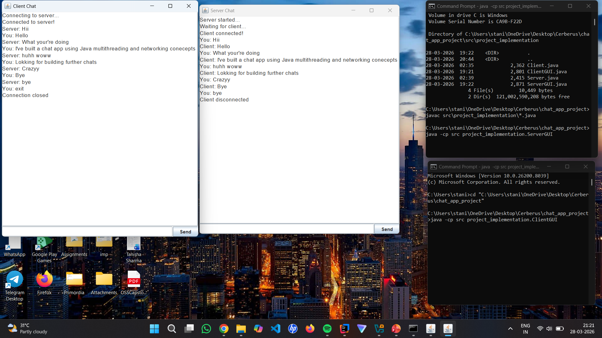

# 💬 Java Chat Application (CLI + GUI)

A real-time chat application developed using **Java Socket Programming** that enables communication between client and server over a network using both Command Line Interface (CLI) and Graphical User Interface (GUI).

## 📂 GitHub Repository
🔗 [View Source Code](https://github.com/DevTanisha-max/java-chat-application)

---

## 📌 Project Overview

This project demonstrates fundamental networking concepts including TCP communication, multithreading, and GUI development using Java Swing. The application allows real-time messaging between a client and server with both terminal and visual interfaces.

---

## 🎯 Features

| Feature                         | Description                                         |
|----------------------------------|-----------------------------------------------------|
| 💬 **Real-time Messaging**       | Instant communication between client and server      |
| 📟 **CLI-based Chat**            | Terminal-based interface for lightweight use         |
| 🖥️ **GUI-based Chat**           | User-friendly graphical interface using Java Swing   |
| 🔄 **Multi-threaded Communication** | Simultaneous read and write operations          |
| 🚪 **Exit Command**              | Safely end connection with `/exit` or "Exit" button |

---

## 🖼️ GUI Preview



---

## 🛠️ Technologies Used

| Category        | Technology                        |
|-----------------|-----------------------------------|
| **Language**    | Java                              |
| **Networking**  | Socket Programming (TCP/IP)       |
| **Concurrency** | Multithreading                    |
| **GUI Framework** | Swing                           |
| **I/O**        | BufferedReader & PrintWriter       |

---

## 📁 Project Structure

```
java-chat-application/
├── chat_app_project/
│   └── src/
│       └── project_implementation/
│           ├── Client.java        # CLI client
│           ├── Server.java        # CLI server
│           ├── ClientGUI.java     # GUI client
│           └── ServerGUI.java     # GUI server
├── Project Report.pdf
├── screenshot.png
└── README.md
```

---

## 🚀 How to Run

### Prerequisites
- Java Development Kit (JDK) 8 or higher
- Command prompt / Terminal

### Step-by-Step Instructions

```bash
# Step 1: Navigate to project directory
cd java-chat-application/chat_app_project

# Step 2: Compile all Java files
javac src/project_implementation/*.java

# Step 3: Run Server (GUI version)
java -cp src project_implementation.ServerGUI

# Step 4: Run Client (GUI version)
java -cp src project_implementation.ClientGUI
```

**For CLI Version:**

```bash
# Run Server CLI
java -cp src project_implementation.Server

# Run Client CLI (in another terminal)
java -cp src project_implementation.Client
```

### ⚙️ Important Instructions

| Order | Action                                                           |
|-------|------------------------------------------------------------------|
| 1️⃣   | Start the server first                                           |
| 2️⃣   | Then start the client                                           |
| 3️⃣   | Both should run on the same machine or network                   |
| 4️⃣   | Type exit or click "Exit" to end connection                      |

---

## 📚 What I Learned

| Concept                    | Application                                    |
|----------------------------|------------------------------------------------|
| Client-Server Architecture | Understanding network communication models      |
| Java Socket Programming    | Hands-on TCP/IP implementation                 |
| Multithreading             | Simultaneous read/write operations             |
| Swing GUI Development      | Building interactive user interfaces           |
| Stream I/O                 | BufferedReader, PrintWriter for data flow      |

---

## 🔮 Future Enhancements

- Multi-client support (one server, many clients)
- Private messaging between clients
- Chat history storage
- User authentication system
- File sharing capability
- Emoji support

---

## 👨‍💻 Author

Tanisha Sharma ([@DevTanisha-max](https://github.com/DevTanisha-max))

| Platform | Link                                  |
|----------|---------------------------------------|
| GitHub   | https://github.com/DevTanisha-max     |
| Project  | Java Chat Application                 |


## 🚀 Key Deliverables

#### 🔧 Backend Logic
- Socket programming for client-server communication
- Multithreading for simultaneous message exchange
- TCP/IP protocol implementation

#### 🎨 Frontend / UI
- CLI-based chat interface
- GUI-based chat using Java Swing
- Event handling for user interactions

#### 📝 Documentation
- Complete setup instructions
- Project report

**Skills Demonstrated:**  
Java Socket Programming · Multithreading · Swing · TCP/IP · OOP · GUI Development · Client-Server Architecture

---

## 📄 License

This project is open-source under the MIT License.

---

## ⭐ Show Your Support

If this project helps you, please give it a ⭐ on GitHub!
